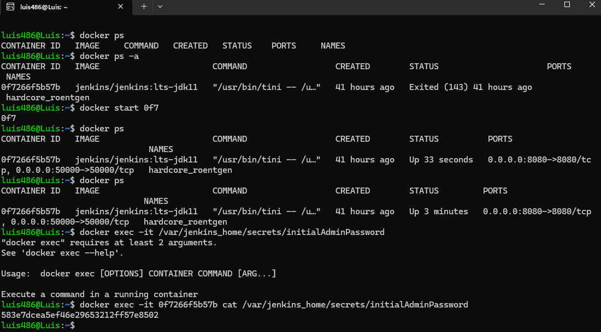
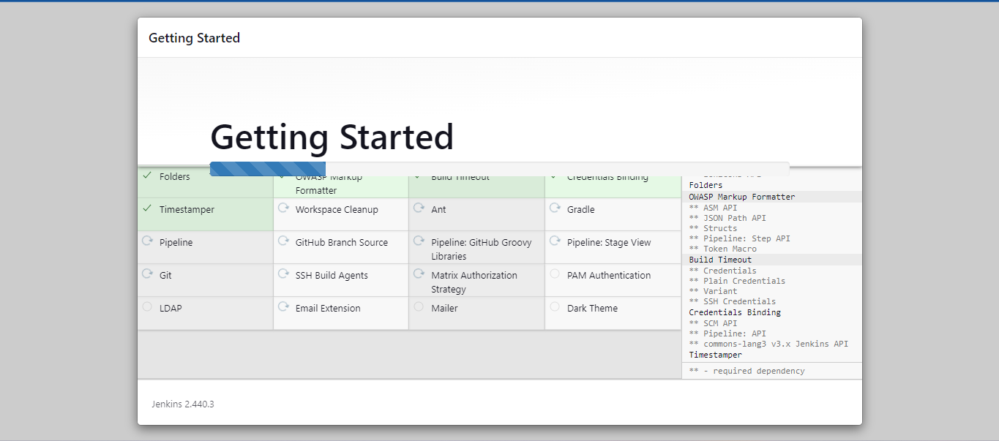
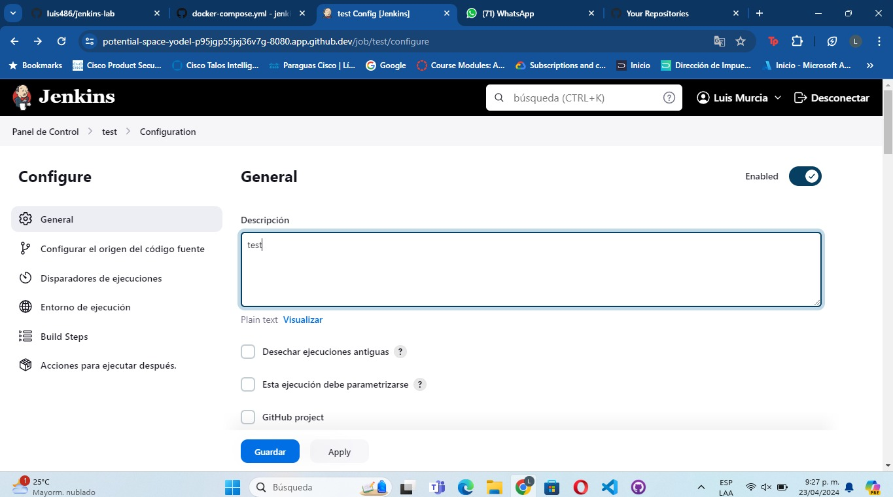
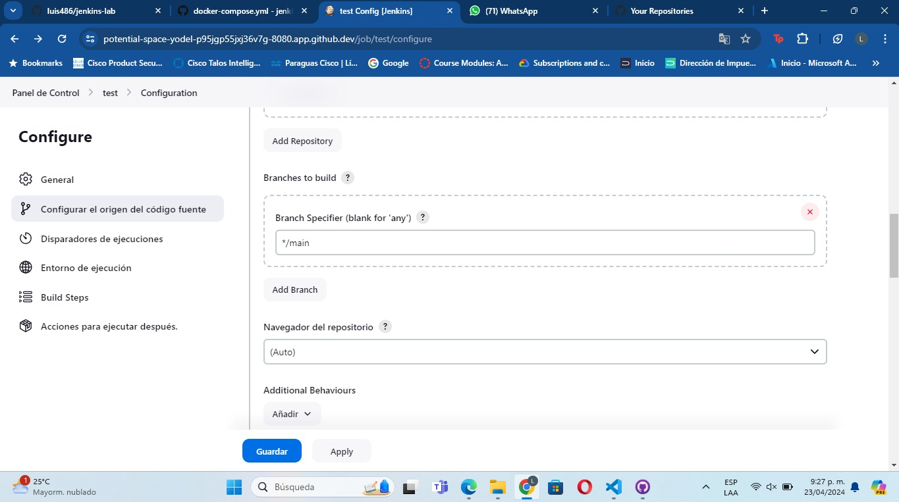
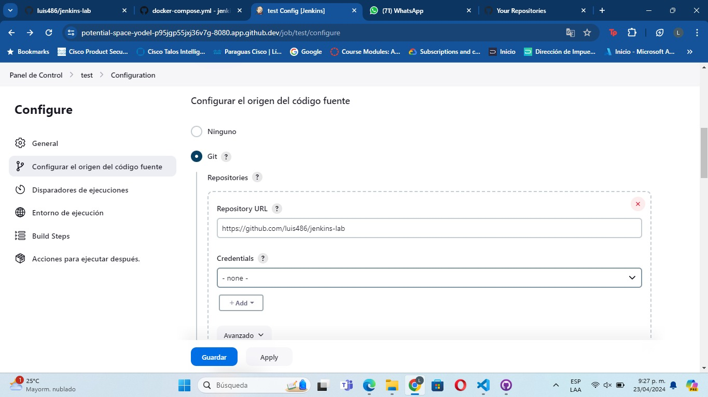

# Jenkins Lab

## Ejecutar Docker Compose

Para ejecutar Docker Compose, asegúrate de que tengas Docker Compose instalado en tu sistema. Luego, sigue estos pasos:

1. Navega a la ubicación donde se encuentra tu archivo `docker-compose.yml`.

2. Ejecuta el siguiente comando en tu terminal para iniciar los contenedores definidos en el archivo `docker-compose.yml`:

```bash
docker-compose up -d
```

3. Extraer passwords

```bash
docker logs id_container
```

```bash
docker exec id_container cat /var/jenkins_home/secrets/initialAdminPassword
```

#### Ejecución 

4. Luego de tener todo bien, es hora de correr nuestro contenedor por el puerto que querramos y le instalamos los plugins predeterminados (si necesitamos más, podremos hacerlo después de la instalación)




5. Luego, para que el jenkins funcione normal, es necesario crear un API Token para el usuario loggeado

6. Es necesario instalar primero los plugins y después crear las tools, para este proyecto necesaritaremos Node.js

7. Se crea el proyecto de estilo libre con un nombre, una descripción, el proyecto de github, la rama etc





8. Se le añade el Node.js

9. Por último, es necesario crear un paso de script para instalar las dependencias y ejecutar la app 


